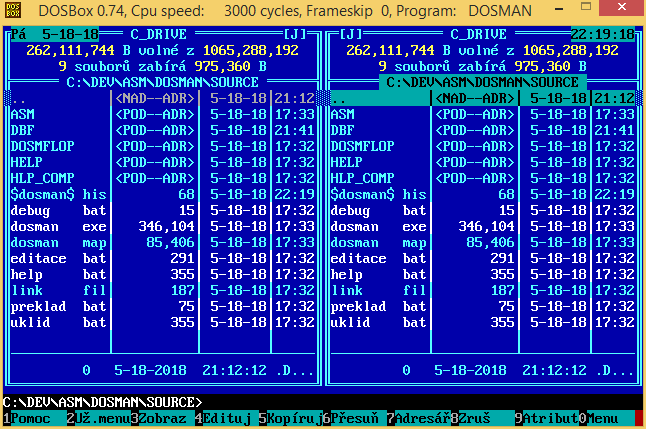

# DOS Manažer

Author: [Miroslav Němeček](https://github.com/oldcompcz/readme/wiki/Nemecek).

## How to build

Make sure you have Turbo Assembler installed and you can run `tasm` and `tlink` at your computer.

* Run `PREKLAD.BAT` for building project
* Run `UKLID.BAT` for cleaning project
* Run `DEBUG.BAT` for debuging project
* Run `EDITACE.BAT` for editing files with kontext editor (*)
* Run `HELP.BAT` for editing help file (*)

(*) You will need kontext editor and cskey, egacs utilities in your path
